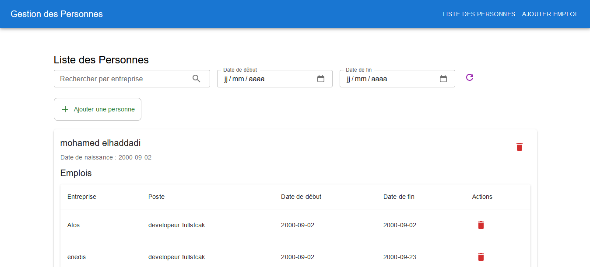
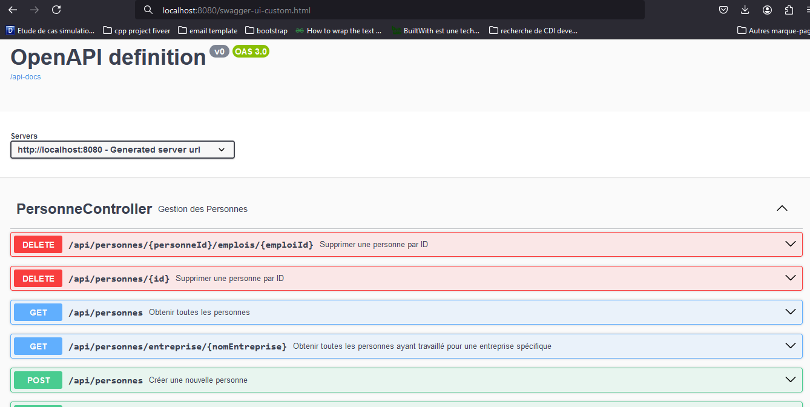

# **Gestion des Personnes et Emplois - Application Web**

## **Description du projet**
Cette application permet de gérer des **personnes** et leurs **emplois** à travers une interface utilisateur intuitive et une API REST. Le backend est développé avec **Spring Boot** et utilise **Hibernate** pour l'ORM. Le frontend est construit avec **React**, choisi pour sa simplicité de configuration adaptée à un projet de petite taille. L'application respecte les bonnes pratiques de développement avec une architecture **API RESTful**, une **base de données relationnelle**, et une **documentation API**.

---

## **Fonctionnalités principales**
1. **Gestion des Personnes** :
   - Ajouter une personne (nom, prénom, date de naissance). Seules les personnes de moins de 150 ans peuvent être enregistrées.
   - Liste des personnes enregistrées, triée par ordre alphabétique, avec indication de leur âge et de leur(s) emploi(s) actuel(s).

2. **Gestion des Emplois** :
   - Ajouter un emploi à une personne avec les informations suivantes : 
     - **Nom de l'entreprise**, **poste occupé**, **date de début** et **date de fin**.
   - Les dates de fin ne sont pas obligatoires pour les emplois en cours.

3. **Requêtes spécifiques** :
   - Récupérer toutes les personnes ayant travaillé pour une entreprise donnée.
   - Récupérer tous les emplois d'une personne entre deux plages de dates.

---

## **Architecture technique**
- **Backend** : 
  - **Framework** : Spring Boot
  - **ORM** : Hibernate
  - **Base de données** : PostgreSQL
  - **Documentation API** : Swagger, accessible à l'URL suivante : [Swagger UI](http://localhost:8080/swagger-ui-custom.html)
  - **Endpoints exposés** :
    - **POST /personnes** : Ajouter une personne.
    - **GET /personnes** : Liste des personnes triée par ordre alphabétique.
    - **POST /personnes/{id}/emplois** : Ajouter un emploi à une personne.
    - **GET /emplois** : Liste des emplois d'une personne entre deux dates.
    - **GET /entreprises/{nom}/personnes** : Liste des personnes ayant travaillé pour une entreprise donnée.

  **Note importante** : Dans le fichier `application.properties`, la propriété `spring.jpa.hibernate.ddl-auto=create` permet de générer automatiquement la structure de la base de données si elle n'existe pas. **Attention**, modifiez les **identifiants et mots de passe** pour la connexion à votre propre base de données PostgreSQL.

- **Frontend** : 
  - **Framework** : React
  - **Design** : Simple et minimaliste, adapté aux besoins d’un projet de petite taille.
  - **Principales fonctionnalités** :
    - Interface pour ajouter une personne.
    - Formulaire pour associer des emplois à une personne.
    - Liste des personnes et de leurs informations (âge, emplois actuels).
    - Recherche d'emplois par entreprise ou par plage de dates.

## **Configurer la base de données :**
1. Assurez-vous que MySql est installé et configuré.

2. Modifiez le fichier `application.properties` dans le backend pour inclure vos informations d'accès à la base :
   ```properties
   spring.datasource.url=jdbc:mysql://localhost:3306/gestionDesEmplois?createDatabaseIfNotExist=true
   spring.datasource.username=VOTRE_UTILISATEUR
   spring.datasource.password=VOTRE_MOT_DE_PASSE
   spring.jpa.hibernate.ddl-auto=create
   ```

## **Lancer le backend :**
1. Accédez au dossier backend :
   ```bash
   cd backend
   ```
2. Exécutez le serveur Spring Boot :
   ```bash
   mvn spring-boot:run
   ```

## **Lancer le frontend :**
1. Accédez au dossier frontend :
   ```bash
   cd frontend
   ```
2. Installez les dépendances :
   ```bash
   npm install
   ```
3. Démarrez l'application React :
   ```bash
   npm start
   ```

## **Accéder à l'application :**
- **Frontend** : [http://localhost:3000](http://localhost:3000)
- **Swagger Documentation API** : [http://localhost:8080/swagger-ui-custom.html](http://localhost:8080/swagger-ui-custom.html)

---

## **Auto-évaluation**

### **Travail réalisé :**
- Développement complet du backend avec gestion des entités Personne et Emploi.
- Mise en place des validations (âge des personnes, chevauchement des dates des emplois).
- Création d'un frontend simple et fonctionnel avec React.
- Documentation complète de l'API avec Swagger.
- Tests unitaires pour les endpoints principaux.

### **Travail non réalisé :**
- Amélioration de la gestion des erreurs pour des retours plus explicites.
- Travail supplémentaire sur le design et la structuration du frontend.
- Ajout de pagination pour les listes volumineuses.

### **Justification des choix techniques :**
- React a été choisi pour sa simplicité et sa rapidité d'installation, idéale pour un projet de petite taille.
- L'accent a été mis sur les fonctionnalités essentielles, étant donné la taille réduite du projet.

---

## **Captures d'écran**
- **Interface utilisateur**
- 
- **Swagger API Documentation**
- 

---

## **Rendu du projet :**
- **Code source Frontend** : [https://github.com/Medhaddadi/web-atrio-test-frontend)
- **Swagger Documentation API** : [http://localhost:8080/swagger-ui-custom.html](http://localhost:8080/swagger-ui-custom.html)
